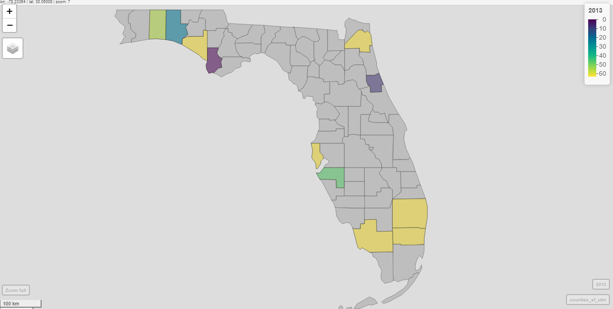

**GitHub Repository**

Link to final project repository: [Garcia_Choi_Panf_ENV872_ProjectRepository](https://github.com/jmg144/Garcia_Choi_Pang_ENV872_ProjectRepository)


# Rationale & Research Questions
**Primary Research Question:** Is there a relationship between sea turtle protection ordinances (light pollution policies) in Florida cities/counties and the amount of radiance those cities/counties output? 

**Additional Research Questions**

* How does radiance change before these light ordinances go into effect and after? I.e. how does radiance change with time?

* How does average radiance over time vary across cities/counties? 


**Rationale**
The state of Florida provided model lighting ordinance for local governments to develop their own light pollution policies largely to control beachfront lighting to protect hatching sea turtles. Policy implementation is important, but the radiance data can show if the policy has affected the amount of radiance in these Florida counties/municipalities. The amount or change in radiance, perhaps as a result of implementing the policy, is what will impact sea turtle protection. 


*Rationale for Data*  

* The GoogleEarth Data Engine Catalog was chosen because it contains The Defense Meteorological Program (DMSP) Operational Line-Scan System (OLS), which has a unique capability to detect visible and near-infrared (VNIR) emission sources at night. And light pollution or radiance at night is what can negatively impact sea turtle hatchlings.

* The radiance data collected covers from 1992 – 2013. However, the cities/counties included in this data analysis are those who implemented sea turtle protection ordinances between 2000 and 2005.

* For the purposes of this data analysis, we chose to only include counties/municipalities that adopted sea turtle protection ordinances between 1994 and 2011, to make sure that there is room for data before and after the policies took effect (buffers).

 
# Dataset Information

Even though this analysis focuses on average yearly data for radiance, we wanted to check quickly to see how it changes throughout the year. We found higher resolution data that pulled average monthly radiance for the years 2012 to 2020, and looked at Atlantic Beach. We saw that there is seasonality in the data, possibly relating to tourist season. We will still focus on yearly average, but it's good to know.
```{r}

```


# Data Wrangling


```{r data wrangling, echo=FALSE}
# Install/load packages


# Import Data


```
# Time Series Data & Pettitt Test


```{r setup,  warning=FALSE, message=FALSE, include = FALSE}
#install.packages("tseries")

library(tidyverse)
library(trend)
library(zoo)
library(Kendall)
library(tseries)
library(lubridate)
library(cowplot)


Radiance_data_long <- read.csv('../Data/Long_20210419.csv')

#Set date as date, create month & day column then join
class(Radiance_data_long$Year)

Radiance_data_long$Month <- 1
Radiance_data_long$Day <-1

Radiance_data_long <-
  Radiance_data_long %>% 
  mutate(Date=(paste0(Year,"-",Month,"-",Day)))


Radiance_data_long$Date <- as.Date(Radiance_data_long$Date, format= "%Y-%m-%d")


class(Radiance_data_long$Date)


#Filter for Cities/Counties with policy implementation between 2000-2005

Radiance_data_long_filtered <-
  Radiance_data_long %>% 
  filter(Implemented %in% 2000:2005)
```

**Locations with increasing radiance trend before and after policy**

* Bay County

* Mexico Beach

* Santa Rosa


```{r warning=FALSE, message=FALSE, include = FALSE}

#Bay County
BayCounty <- Radiance_data_long_filtered %>% 
  filter(County == "Bay County")

BayCounty.plotA <-
 ggplot(BayCounty, aes (x=Date, y=value))+
  geom_line()+
  labs(x="Year", y="Radiance")+
  ggtitle("Bay County", subtitle= "Average annual radiance before policy")+
  geom_vline(xintercept = as.numeric(ymd("2002-01-01")), lty=2, color ="red")+
  theme(plot.title=element_text(face="bold"), plot.subtitle = element_text(hjust=0.5))+
  theme(axis.text.x = element_text(angle=45, hjust=1))+
  scale_x_date(limits=as.Date(c("1992-01-01","2002-01-01")), date_breaks = "2 years", date_labels = "%Y")+
  geom_smooth(method = "lm", se = FALSE)

BayCounty.plotA


BayCounty.plotB <-
 ggplot(BayCounty, aes (x=Date, y=value))+
  geom_line()+
  labs(x="Year", y=" ")+
  ggtitle(" ", subtitle= "After policy")+
  geom_vline(xintercept = as.numeric(ymd("2002-01-01")), lty=2, color ="red")+
  theme(plot.title=element_text(hjust=0.5, face="bold"), plot.subtitle = element_text(hjust=0.5))+
  theme(axis.text.x = element_text(angle=45, hjust=1))+
  scale_x_date(limits=as.Date(c("2002-01-01", "2013-01-01")), date_breaks = "2 years", date_labels = "%Y")+
  geom_smooth(method = "lm", se = FALSE)

BayCounty.plotB
```

```{r warning=FALSE, message=FALSE, echo=FALSE}
plot_grid(BayCounty.plotA, BayCounty.plotB, nrow=1, align='h')

```

```{r warning=FALSE, message=FALSE, include = FALSE}
#Mexico Beach
MexicoBeach <- Radiance_data_long_filtered %>% 
  filter(County == "Meixco Beach")

MexicoBeach.plotA <-
 ggplot(MexicoBeach, aes (x=Date, y=value))+
  geom_line()+
  labs(x="Year", y="Radiance")+
  ggtitle("Mexico Beach", subtitle= "Average annual radiance before policy")+
  geom_vline(xintercept = as.numeric(ymd("2001-01-01")), lty=2, color ="red")+
  theme(plot.title=element_text(face="bold"), plot.subtitle = element_text(hjust=0.5))+
  theme(axis.text.x = element_text(angle=45, hjust=1))+
  scale_x_date(limits=as.Date(c("1992-01-01","2001-01-01")), date_breaks = "2 years", date_labels = "%Y")+
  geom_smooth(method = "lm", se = FALSE)

MexicoBeach.plotA


MexicoBeach.plotB <-
 ggplot(MexicoBeach, aes (x=Date, y=value))+
  geom_line()+
  labs(x="Year", y="")+
  ggtitle("", subtitle= "After policy")+
  geom_vline(xintercept = as.numeric(ymd("2001-01-01")), lty=2, color ="red")+
  theme(plot.title=element_text(hjust=0.5, face="bold"), plot.subtitle = element_text(hjust=0.5))+
  theme(axis.text.x = element_text(angle=45, hjust=1))+
  scale_x_date(limits=as.Date(c("2001-01-01", "2013-01-01")), date_breaks = "2 years", date_labels = "%Y")+
  geom_smooth(method = "lm", se = FALSE)

MexicoBeach.plotB

```

```{r warning=FALSE, message=FALSE, echo=FALSE}
plot_grid(MexicoBeach.plotA, MexicoBeach.plotB, nrow=1, align='h')

```

```{r warning=FALSE, message=FALSE, include = FALSE}
#Santa Rosa
SantaRosa <- Radiance_data_long_filtered %>% 
  filter(County == "Santa Rosa")

SantaRosa.plotA <-
 ggplot(SantaRosa, aes (x=Date, y=value))+
  geom_line()+
  labs(x="Year", y="Radiance")+
  ggtitle("Santa Rosa", subtitle= "Average annual radiance before policy")+
  geom_vline(xintercept = as.numeric(ymd("2005-01-01")), lty=2, color ="red")+
  theme(plot.title=element_text(face="bold"), plot.subtitle = element_text(hjust=0.5))+
  theme(axis.text.x = element_text(angle=45, hjust=1))+
  scale_x_date(limits=as.Date(c("1992-01-01","2005-01-01")), date_breaks = "2 years", date_labels = "%Y")+
  geom_smooth(method = "lm", se = FALSE)

SantaRosa.plotA


SantaRosa.plotB <-
 ggplot(SantaRosa, aes (x=Date, y=value))+
  geom_line()+
  labs(x="Year", y="")+
  ggtitle("", subtitle= "After policy")+
  geom_vline(xintercept = as.numeric(ymd("2005-01-01")), lty=2, color ="red")+
  theme(plot.title=element_text(hjust=0.5, face="bold"), plot.subtitle = element_text(hjust=0.5))+
  theme(axis.text.x = element_text(angle=45, hjust=1))+
  scale_x_date(limits=as.Date(c("2005-01-01", "2013-01-01")), date_breaks = "2 years", date_labels = "%Y")+
  geom_smooth(method = "lm", se = FALSE)

SantaRosa.plotB

```

```{r warning=FALSE, message=FALSE, echo = FALSE}
plot_grid(SantaRosa.plotA, SantaRosa.plotB, nrow=1, align='h')

```


**Locations with decreasing radiance trends before and after policy**

* Gulf County

* Pinelals County


```{r warning=FALSE, message=FALSE, include = FALSE}
#Gulf County
GulfCounty <- Radiance_data_long_filtered %>% 
  filter(County == "GUlf COunty")

GulfCounty.plotA <-
 ggplot(GulfCounty, aes (x=Date, y=value))+
  geom_line()+
  labs(x="Year", y="Radiance")+
  ggtitle("Gulf County", subtitle= "Average annual radiance before policy")+
  geom_vline(xintercept = as.numeric(ymd("2001-01-01")), lty=2, color ="red")+
  theme(plot.title=element_text(face="bold"), plot.subtitle = element_text(hjust=0.5))+
  theme(axis.text.x = element_text(angle=45, hjust=1))+
  scale_x_date(limits=as.Date(c("1992-01-01","2001-01-01")), date_breaks = "2 years", date_labels = "%Y")+
  geom_smooth(method = "lm", se = FALSE)

GulfCounty.plotA


GulfCounty.plotB <-
 ggplot(GulfCounty, aes (x=Date, y=value))+
  geom_line()+
  labs(x="Year", y="")+
  ggtitle("", subtitle= "After policy")+
  geom_vline(xintercept = as.numeric(ymd("2001-01-01")), lty=2, color ="red")+
  theme(plot.title=element_text(hjust=0.5, face="bold"), plot.subtitle = element_text(hjust=0.5))+
  theme(axis.text.x = element_text(angle=45, hjust=1))+
  scale_x_date(limits=as.Date(c("2001-01-01", "2013-01-01")), date_breaks = "2 years", date_labels = "%Y")+
  geom_smooth(method = "lm", se = FALSE)

GulfCounty.plotB
```

```{r warning=FALSE, message=FALSE, echo = FALSE}
plot_grid(GulfCounty.plotA, GulfCounty.plotB, nrow=1, align='h')
```

```{r warning=FALSE, message=FALSE, include = FALSE}
#Pinelals County
PinelalsCounty <- Radiance_data_long_filtered %>% 
  filter(County == "Pinelals County")

PinelalsCounty.plotA <-
 ggplot(PinelalsCounty, aes (x=Date, y=value))+
  geom_line()+
  labs(x="Year", y="Radiance")+
  ggtitle("Pinelals County", subtitle= "Average annual radiance before policy")+
  geom_vline(xintercept = as.numeric(ymd("2004-01-01")), lty=2, color ="red")+
  theme(plot.title=element_text(face="bold"), plot.subtitle = element_text(hjust=0.5))+
  theme(axis.text.x = element_text(angle=45, hjust=1))+
  scale_x_date(limits=as.Date(c("1992-01-01","2004-01-01")), date_breaks = "2 years", date_labels = "%Y")+
  geom_smooth(method = "lm", se = FALSE)

PinelalsCounty.plotA


PinelalsCounty.plotB <-
 ggplot(PinelalsCounty, aes (x=Date, y=value))+
  geom_line()+
  labs(x="Year", y="")+
  ggtitle("", subtitle= "After policy")+
  geom_vline(xintercept = as.numeric(ymd("2004-01-01")), lty=2, color ="red")+
  theme(plot.title=element_text(hjust=0.5, face="bold"), plot.subtitle = element_text(hjust=0.5))+
  theme(axis.text.x = element_text(angle=45, hjust=1))+
  scale_x_date(limits=as.Date(c("2004-01-01", "2013-01-01")), date_breaks = "2 years", date_labels = "%Y")+
  geom_smooth(method = "lm", se = FALSE)

PinelalsCounty.plotB
```

```{r warning=FALSE, message=FALSE, echo = FALSE}
plot_grid(PinelalsCounty.plotA, PinelalsCounty.plotB, nrow=1, align='h')

```


**Locations decreasing before policy and increasing after policy**
* Deerfield Beach  

* Fort Lauderdale  

* Hallandale Beach  

* Lauderdale by the Sea  

* Jacksonville Beach  

* Flagler County  

* Bonita Springs  

* Ana Maria Island  

* Destin

```{r warning=FALSE, message=FALSE, include = FALSE}
#Deerfield Beach
DeerfieldBeach <- Radiance_data_long_filtered %>% 
  filter(County == "Deerfield Beach")

DeerfieldBeach.plotA <-
 ggplot(DeerfieldBeach, aes (x=Date, y=value))+
  geom_line()+
  labs(x="Year", y="Radiance")+
  ggtitle("Deerfield Beach", subtitle= "Average annual radiance before policy")+
  geom_vline(xintercept = as.numeric(ymd("2000-01-01")), lty=2, color ="red")+
  theme(plot.title=element_text(face="bold"), plot.subtitle = element_text(hjust=0.5))+
  theme(axis.text.x = element_text(angle=45, hjust=1))+
  scale_x_date(limits=as.Date(c("1992-01-01","2000-01-01")), date_breaks = "2 years", date_labels = "%Y")+
  geom_smooth(method = "lm", se = FALSE)

DeerfieldBeach.plotA


DeerfieldBeach.plotB <-
 ggplot(DeerfieldBeach, aes (x=Date, y=value))+
  geom_line()+
  labs(x="Year", y="")+
  ggtitle("", subtitle= "After policy")+
  geom_vline(xintercept = as.numeric(ymd("2000-01-01")), lty=2, color ="red")+
  theme(plot.title=element_text(hjust=0.5, face="bold"), plot.subtitle = element_text(hjust=0.5))+
  theme(axis.text.x = element_text(angle=45, hjust=1))+
  scale_x_date(limits=as.Date(c("2000-01-01", "2013-01-01")), date_breaks = "2 years", date_labels = "%Y")+
  geom_smooth(method = "lm", se = FALSE)

DeerfieldBeach.plotB
```

```{r warning=FALSE, message=FALSE, echo = FALSE}
plot_grid(DeerfieldBeach.plotA, DeerfieldBeach.plotB, nrow=1, align='h')
```

```{r warning=FALSE, message=FALSE, include = FALSE}
#Fort Lauderdale
FortLauderdale <- Radiance_data_long_filtered %>% 
  filter(County == "Fort Lauderdale")

FortLauderdale.plotA <-
 ggplot(DeerfieldBeach, aes (x=Date, y=value))+
  geom_line()+
  labs(x="Year", y="Radiance")+
  ggtitle("Fort Lauderdale", subtitle= "Average annual radiance before policy")+
  geom_vline(xintercept = as.numeric(ymd("2003-01-01")), lty=2, color ="red")+
  theme(plot.title=element_text(face="bold"), plot.subtitle = element_text(hjust=0.5))+
  theme(axis.text.x = element_text(angle=45, hjust=1))+
  scale_x_date(limits=as.Date(c("1992-01-01","2003-01-01")), date_breaks = "2 years", date_labels = "%Y")+
  geom_smooth(method = "lm", se = FALSE)

FortLauderdale.plotA


FortLauderdale.plotB <-
 ggplot(DeerfieldBeach, aes (x=Date, y=value))+
  geom_line()+
  labs(x="Year", y="")+
  ggtitle("", subtitle= "After policy")+
  geom_vline(xintercept = as.numeric(ymd("2003-01-01")), lty=2, color ="red")+
  theme(plot.title=element_text(hjust=0.5, face="bold"), plot.subtitle = element_text(hjust=0.5))+
  theme(axis.text.x = element_text(angle=45, hjust=1))+
  scale_x_date(limits=as.Date(c("2003-01-01", "2013-01-01")), date_breaks = "2 years", date_labels = "%Y")+
  geom_smooth(method = "lm", se = FALSE)

FortLauderdale.plotB
```

```{r warning=FALSE, message=FALSE, echo = FALSE}
plot_grid(FortLauderdale.plotA, FortLauderdale.plotB, nrow=1, align='h')
```

```{r warning=FALSE, message=FALSE, include = FALSE}
#Hallandale Beach
HallandaleBeach <- Radiance_data_long_filtered %>% 
  filter(County == "Hallandale Beach")

HallandaleBeach.plotA <-
 ggplot(HallandaleBeach, aes (x=Date, y=value))+
  geom_line()+
  labs(x="Year", y="Radiance")+
  ggtitle("Hallandale Beach", subtitle= "Average annual radiance before policy")+
  geom_vline(xintercept = as.numeric(ymd("2001-01-01")), lty=2, color ="red")+
  theme(plot.title=element_text(face="bold"), plot.subtitle = element_text(hjust=0.5))+
  theme(axis.text.x = element_text(angle=45, hjust=1))+
  scale_x_date(limits=as.Date(c("1992-01-01","2001-01-01")), date_breaks = "2 years", date_labels = "%Y")+
  geom_smooth(method = "lm", se = FALSE)

HallandaleBeach.plotA


HallandaleBeach.plotB <-
 ggplot(DeerfieldBeach, aes (x=Date, y=value))+
  geom_line()+
  labs(x="Year", y="")+
  ggtitle("", subtitle= "After policy")+
  geom_vline(xintercept = as.numeric(ymd("2001-01-01")), lty=2, color ="red")+
  theme(plot.title=element_text(hjust=0.5, face="bold"), plot.subtitle = element_text(hjust=0.5))+
  theme(axis.text.x = element_text(angle=45, hjust=1))+
  scale_x_date(limits=as.Date(c("2001-01-01", "2013-01-01")), date_breaks = "2 years", date_labels = "%Y")+
  geom_smooth(method = "lm", se = FALSE)

HallandaleBeach.plotB
```

```{r warning=FALSE, message=FALSE, echo = FALSE}
plot_grid(HallandaleBeach.plotA, HallandaleBeach.plotB, nrow=1, align='h')
```

```{r warning=FALSE, message=FALSE, include = FALSE}
#Lauderdale By the Sea
LauderdaleBySea <- Radiance_data_long_filtered %>% 
  filter(County == "Lauderdale By the Sea")

LauderdaleBySea.plotA <-
 ggplot(LauderdaleBySea, aes (x=Date, y=value))+
  geom_line()+
  labs(x="Year", y="Radiance")+
  ggtitle("Lauderdale By the Sea", subtitle= "Average annual radiance before policy")+
  geom_vline(xintercept = as.numeric(ymd("2002-01-01")), lty=2, color ="red")+
  theme(plot.title=element_text(face="bold"), plot.subtitle = element_text(hjust=0.5))+
  theme(axis.text.x = element_text(angle=45, hjust=1))+
  scale_x_date(limits=as.Date(c("1992-01-01","2002-01-01")), date_breaks = "2 years", date_labels = "%Y")+
  geom_smooth(method = "lm", se = FALSE)

LauderdaleBySea.plotA


LauderdaleBySea.plotB <-
 ggplot(LauderdaleBySea, aes (x=Date, y=value))+
  geom_line()+
  labs(x="Year", y="")+
  ggtitle("", subtitle= "After policy")+
  geom_vline(xintercept = as.numeric(ymd("2002-01-01")), lty=2, color ="red")+
  theme(plot.title=element_text(hjust=0.5, face="bold"), plot.subtitle = element_text(hjust=0.5))+
  theme(axis.text.x = element_text(angle=45, hjust=1))+
  scale_x_date(limits=as.Date(c("2002-01-01", "2013-01-01")), date_breaks = "2 years", date_labels = "%Y")+
  geom_smooth(method = "lm", se = FALSE)

LauderdaleBySea.plotB
```

```{r warning=FALSE, message=FALSE, echo = FALSE}
plot_grid(LauderdaleBySea.plotA, LauderdaleBySea.plotB, nrow=1, align='h')
```

```{r warning=FALSE, message=FALSE, include = FALSE}
#Jacksonville Beach
JacksonvilleBeach <- Radiance_data_long_filtered %>% 
  filter(County == "Jacksonville beach")

JacksonvilleBeach.plotA <-
 ggplot(JacksonvilleBeach, aes (x=Date, y=value))+
  geom_line()+
  labs(x="Year", y="Radiance")+
  ggtitle("Jacksonville Beach", subtitle= "Average annual radiance before policy")+
  geom_vline(xintercept = as.numeric(ymd("2000-01-01")), lty=2, color ="red")+
  theme(plot.title=element_text(face="bold"), plot.subtitle = element_text(hjust=0.5))+
  theme(axis.text.x = element_text(angle=45, hjust=1))+
  scale_x_date(limits=as.Date(c("1992-01-01","2000-01-01")), date_breaks = "2 years", date_labels = "%Y")+
  geom_smooth(method = "lm", se = FALSE)

JacksonvilleBeach.plotA


JacksonvilleBeach.plotB <-
 ggplot(JacksonvilleBeach, aes (x=Date, y=value))+
  geom_line()+
  labs(x="Year", y="")+
  ggtitle("", subtitle= "After policy")+
  geom_vline(xintercept = as.numeric(ymd("2000-01-01")), lty=2, color ="red")+
  theme(plot.title=element_text(hjust=0.5, face="bold"), plot.subtitle = element_text(hjust=0.5))+
  theme(axis.text.x = element_text(angle=45, hjust=1))+
  scale_x_date(limits=as.Date(c("2000-01-01", "2013-01-01")), date_breaks = "2 years", date_labels = "%Y")+
  geom_smooth(method = "lm", se = FALSE)

JacksonvilleBeach.plotB
```

```{r warning=FALSE, message=FALSE, echo = FALSE}
plot_grid(JacksonvilleBeach.plotA, JacksonvilleBeach.plotB, nrow=1, align='h')
```


```{r warning=FALSE, message=FALSE, include = FALSE}
#Flagler County
FlaglerCounty <- Radiance_data_long_filtered %>% 
  filter(County == "Flagler COunty")

FlaglerCounty.plotA <-
 ggplot(FlaglerCounty, aes (x=Date, y=value))+
  geom_line()+
  labs(x="Year", y="Radiance")+
  ggtitle("Flagler County", subtitle= "Average annual radiance before policy")+
  geom_vline(xintercept = as.numeric(ymd("2001-01-01")), lty=2, color ="red")+
  theme(plot.title=element_text(face="bold"), plot.subtitle = element_text(hjust=0.5))+
  theme(axis.text.x = element_text(angle=45, hjust=1))+
  scale_x_date(limits=as.Date(c("1992-01-01","2001-01-01")), date_breaks = "2 years", date_labels = "%Y")+
  geom_smooth(method = "lm", se = FALSE)

FlaglerCounty.plotA


FlaglerCounty.plotB <-
 ggplot(FlaglerCounty, aes (x=Date, y=value))+
  geom_line()+
  labs(x="Year", y="")+
  ggtitle("", subtitle= "After policy")+
  geom_vline(xintercept = as.numeric(ymd("2001-01-01")), lty=2, color ="red")+
  theme(plot.title=element_text(hjust=0.5, face="bold"), plot.subtitle = element_text(hjust=0.5))+
  theme(axis.text.x = element_text(angle=45, hjust=1))+
  scale_x_date(limits=as.Date(c("2001-01-01", "2013-01-01")), date_breaks = "2 years", date_labels = "%Y")+
  geom_smooth(method = "lm", se = FALSE)

FlaglerCounty.plotB
```

```{r warning=FALSE, message=FALSE, echo = FALSE}
plot_grid(FlaglerCounty.plotA, FlaglerCounty.plotB, nrow=1, align='h')
```

```{r warning=FALSE, message=FALSE, include = FALSE}
#Bonita Springs
BonitaSprings <- Radiance_data_long_filtered %>% 
  filter(County == "Bonita SPrings")

BonitaSprings.plotA <-
 ggplot(BonitaSprings, aes (x=Date, y=value))+
  geom_line()+
  labs(x="Year", y="Radiance")+
  ggtitle("Bonita Springs", subtitle= "Average annual radiance before policy")+
  geom_vline(xintercept = as.numeric(ymd("2001-01-01")), lty=2, color ="red")+
  theme(plot.title=element_text(face="bold"), plot.subtitle = element_text(hjust=0.5))+
  theme(axis.text.x = element_text(angle=45, hjust=1))+
  scale_x_date(limits=as.Date(c("1992-01-01","2001-01-01")), date_breaks = "2 years", date_labels = "%Y")+
  geom_smooth(method = "lm", se = FALSE)

BonitaSprings.plotA


BonitaSprings.plotB <-
 ggplot(BonitaSprings, aes (x=Date, y=value))+
  geom_line()+
  labs(x="Year", y="")+
  ggtitle("", subtitle= "After policy")+
  geom_vline(xintercept = as.numeric(ymd("2001-01-01")), lty=2, color ="red")+
  theme(plot.title=element_text(hjust=0.5, face="bold"), plot.subtitle = element_text(hjust=0.5))+
  theme(axis.text.x = element_text(angle=45, hjust=1))+
  scale_x_date(limits=as.Date(c("2001-01-01", "2013-01-01")), date_breaks = "2 years", date_labels = "%Y")+
  geom_smooth(method = "lm", se = FALSE)

BonitaSprings.plotB
```

```{r warning=FALSE, message=FALSE, echo = FALSE}
plot_grid(BonitaSprings.plotA, BonitaSprings.plotB, nrow=1, align='h')
```

```{r warning=FALSE, message=FALSE, include = FALSE}
#Anna Maria Island
AnnaMariaIsland <- Radiance_data_long_filtered %>% 
  filter(County == "Anna Maria Island")

AnnaMariaIsland.plotA <-
 ggplot(AnnaMariaIsland, aes (x=Date, y=value))+
  geom_line()+
  labs(x="Year", y="Radiance")+
  ggtitle("Anna Maria Island", subtitle= "Average annual radiance before policy")+
  geom_vline(xintercept = as.numeric(ymd("2003-01-01")), lty=2, color ="red")+
  theme(plot.title=element_text(face="bold"), plot.subtitle = element_text(hjust=0.5))+
  theme(axis.text.x = element_text(angle=45, hjust=1))+
  scale_x_date(limits=as.Date(c("1992-01-01","2003-01-01")), date_breaks = "2 years", date_labels = "%Y")+
  geom_smooth(method = "lm", se = FALSE)

AnnaMariaIsland.plotA


AnnaMariaIsland.plotB <-
 ggplot(AnnaMariaIsland, aes (x=Date, y=value))+
  geom_line()+
  labs(x="Year", y="")+
  ggtitle("", subtitle= "After policy")+
  geom_vline(xintercept = as.numeric(ymd("2003-01-01")), lty=2, color ="red")+
  theme(plot.title=element_text(hjust=0.5, face="bold"), plot.subtitle = element_text(hjust=0.5))+
  theme(axis.text.x = element_text(angle=45, hjust=1))+
  scale_x_date(limits=as.Date(c("2003-01-01", "2013-01-01")), date_breaks = "2 years", date_labels = "%Y")+
  geom_smooth(method = "lm", se = FALSE)

AnnaMariaIsland.plotB
```

```{r warning=FALSE, message=FALSE, echo = FALSE}
plot_grid(AnnaMariaIsland.plotA, AnnaMariaIsland.plotB, nrow=1, align='h')
```


```{r warning=FALSE, message=FALSE, include = FALSE}
#Destin
Destin <- Radiance_data_long_filtered %>% 
  filter(County == "Destin")

Destin.plotA <-
 ggplot(Destin, aes (x=Date, y=value))+
  geom_line()+
  labs(x="Year", y="Radiance")+
  ggtitle("Destin", subtitle= "Average annual radiance before policy")+
  geom_vline(xintercept = as.numeric(ymd("2004-01-01")), lty=2, color ="red")+
  theme(plot.title=element_text(face="bold"), plot.subtitle = element_text(hjust=0.5))+
  theme(axis.text.x = element_text(angle=45, hjust=1))+
  scale_x_date(limits=as.Date(c("1992-01-01","2004-01-01")), date_breaks = "2 years", date_labels = "%Y")+
  geom_smooth(method = "lm", se = FALSE)

Destin.plotA


Destin.plotB <-
 ggplot(Destin, aes (x=Date, y=value))+
  geom_line()+
  labs(x="Year", y="")+
  ggtitle("", subtitle= "After policy")+
  geom_vline(xintercept = as.numeric(ymd("2004-01-01")), lty=2, color ="red")+
  theme(plot.title=element_text(hjust=0.5, face="bold"), plot.subtitle = element_text(hjust=0.5))+
  theme(axis.text.x = element_text(angle=45, hjust=1))+
  scale_x_date(limits=as.Date(c("2004-01-01", "2013-01-01")), date_breaks = "2 years", date_labels = "%Y")+
  geom_smooth(method = "lm", se = FALSE)

Destin.plotB
```

```{r warning=FALSE, message=FALSE, echo = FALSE}
plot_grid(Destin.plotA, Destin.plotB, nrow=1, align='h')
```

# Spatial Analysis

```{r data wrangling for spatial analysis}
##data wrangling for spatial Analysis

library(sf)
library(mapview)

getwd()
#Function for demonstrating the status of implementation (Y denotes that it has implemented  the ordinance, and N denotes that it has not implemented the  ordinance)

implementation_status <- function(x,y){
  s<-ifelse(y>x, "Y", "N")
  return(s)
}


#Add the the status of implementation by use function implementation_status and select counties with implementation year between 2000 and 2005
Light_data_processed <- Radiance_data_long %>%
  mutate(Status=implementation_status(Implemented, Year)) %>%
  filter(Implemented > 1999 & Implemented < 2006)

#Load Florida Counties shapefile
counties_shp_data<- st_read('../Data/cb_2018_us_county_20m.shp') %>% 
  filter(STATEFP == 12)

#get the combined data (combine counties_shp_data with Light_data_processed)

#Combine Light data with County shp by using COUNTYFP
#load dataset including COUNTYFP and County
FP <- read.csv("../Data/FP1.csv")
FP <- select(FP, County= 1, COUNTYFP)
FP$COUNTYFP <- as.numeric(FP$COUNTYFP)

#1. combine FP with Light data (not sf data)
#select columns of Light_data_processed (drop long and lat)
Light_no_sf <- select(Light_data_processed, X:value, Status)

# merge
Light_FP <- merge(Light_no_sf, FP, by="County", all=TRUE)

#2. combine Light_FP with County shp (not sf data)
#select columns of County shp
Map_match <- select(counties_shp_data, STATEFP:NAME, geometry)
Map_match$COUNTYFP <- as.numeric(Map_match$COUNTYFP)

# merge and drop na
Light_Map_FP <-merge(Map_match,Light_FP, by="COUNTYFP", all=TRUE)
combined_data <- drop_na(Light_Map_FP)

#save combined data
#write.csv(combined_data, row.names = FALSE, file = "../Data/combined_data.csv")

#transfer the Light data and combine data to sf data
Light_sf <- st_as_sf(Light_data_processed,
                  coords = c('Long','Lat'),
                  crs=4326)
```

> We used both mapview and ggplot for sptial analysis

```{r spatial analysis by using mapview}
## plot the light radiance value in all years and all relevant counties simultaneously on one map (mapview function)

#time span
t<-c(1992:2013)

#plot function
plot_years_counties_A <- function(y){
  myMap <- mapview(counties_shp_data, 
                   col.regions='gray',
                   alpha.regions=1,
                   legend=FALSE)
  for (y in t){
    Light_radiation <- filter(combined_data, Year==y)
    myMap <- myMap +
      mapview(Light_radiation, 
              zcol='value',
              alpha.regions=0.5,
              layer.name= y)
    y=y+1
  }
  print(myMap)
}
plot_years_counties_A(1992)


## plot the light radiance value for different years one by one (mapview function)

t<-c(1992:2013)
plot_years_counties_B <- function(y){
  for (y in t){
    Light_radiation <- filter(combined_data, Year==y)
    myMap <- mapview(counties_shp_data, 
                     col.regions='gray',
                     alpha.regions=1,
                     legend=FALSE) +
      mapview(Light_radiation, 
              zcol='value',
              alpha.regions=0.5,
              layer.name= y)
    print(myMap)
    y=y+1
  }
}
plot_years_counties_B(1992)

```

> The graph plotted by mapview can not be knitted, so we show the graphs for 1992 and 2013 as shown:




> As shown above, the value of light radiance decreased in some counties/locations such as Destin & Anna Maria Island; the value of light radiance changed a little in some counties/locations such as GUlf COunty & Jacksonville beach; the value of light radiance increased in some counties/locations such as Bay County & Walton.

```{r spatial analysis by using ggplot, echo = FALSE}
## ## plot the light radiance value for different years one by one (ggplot function)
t<-c(1992:2013)
plot_years_counties_C <- function(y){
  for (y in t){
    Light_year<- filter(Light_sf, Year==y)
    myMap <- ggplot() + 
      geom_sf(data = counties_shp_data) 
    myMap <- myMap + geom_sf(data = Light_year, aes(color = Status, size= value)) +
      labs(title=y) +
      scale_color_brewer(palette = "YlGnBu")
    print(myMap)
    y<-y+1
  }
}
#plot_years_counties_C(1992)

#D. Compare the mean of the value of light radiance  before and after implementation (mapview function)

#set the color palette 
#colors <- colorRampPalette(c("yellow", "navy"))(14)

#group data by Status and County
Light_group <- 
  Light_data_processed %>%
  group_by(Status,County) %>%
  summarise(meanvalue=mean(value))

#select needed columns
Light_no_sf_2 <- select(Light_data_processed, County, Long:Lat)

# drop duplicates
Light_no_sf_3<- Light_no_sf_2[!duplicated(Light_no_sf_2$County),]

#combine data
Light_group_no_sf <- merge(Light_group, Light_no_sf_3, by="County", all=TRUE)

# sf transfer

Light_group_sf <- st_as_sf(Light_group_no_sf,
                     coords = c('Long','Lat'),
                     crs=4326)
# divided data according to implementation
Light_group_sf_N <- filter(Light_group_sf, Status=="N")
Light_group_sf_Y <- filter(Light_group_sf, Status=="Y")


#data wrangling
Light_group_no_sf_N <- filter(Light_group_no_sf, Status=="N")
Light_group_no_sf_Y <- filter(Light_group_no_sf, Status=="Y")
Light_group_no_sf_Y <- select(Light_group_no_sf_Y, County:meanvalue)


NY <- merge(Light_group_no_sf_N, Light_group_no_sf_Y, by="County")
NY <- mutate(NY, dif=(NY$meanvalue.x-NY$meanvalue.y))

NY_sf <- st_as_sf(NY,
                           coords = c('Long','Lat'),
                           crs=4326)
#plot
myMap <- mapview(counties_shp_data, 
                 col.regions="gray",
                 alpha.regions=1,
                 legend=FALSE) +
  mapview(NY_sf,
          zcol='dif',
          alpha.regions=1,
          cex='meanvalue.x') 
#print(myMap)

#plot by using ggplot

myMap <- ggplot() +
  geom_sf(data = counties_shp_data) +
  geom_sf(data = NY_sf, aes(color = dif, size= meanvalue.x)) +
  scale_color_gradient2(low = 'red', high = 'green', midpoint = 0)

print(myMap)

```
> Because mapview also did not work for rmd, so we used ggplot to plot the difference of the mean value of the light radiation before and after the implementation of the ordinance for different counties/locations. 

> As shown above, the color denotes the difference between the mean value of the light radiation before and after the implementation of the ordinance. Negative df means the light radiation decreased after the implementation of the ordinance and positive df means the light radiation increased after the implementation of the ordinance. Only in three counties/locations, light radiation decreased after the implementation of ordinance, which means Sea Turtle Lighting Ordinance only works for a few counties


> The size of the circle represented the value of the mean light radiation before the implementation of the ordinance, which can be considered as the baseline of Light radiation. This graph also demonstrated that counties/locations that have a higher baseline (meanvalue.x) usually have small light radiation differences (diff). The higher baseline may result from the population or economic development. Further research related to investigating the impacts of socioeconomic metrics on light radiation as well as the implementation of the sea turtle lighting ordinance will be needed.


# Analysis & Conclusions
Our analysis indicates that there is not a strong connection between the sea turtle protection ordinances in Florida and the amount of radiance emitted. We had anticipated seeing a decrease in radiance after a policy was implemented, but this was not a trend we saw. In fact, in more cases than not we saw that radiance had a trend of increasing after the implementation of the policy compared to the trend prior to the policy. However, we believe that is more likely due to other factors/variables such as population growth and urbanization, rather than the policy implementation. 


**Further Research & Data**  
Further research on this could be done using longer time periods of data, since we only had radiance data from 1992-2013. An additional shortcoming of our dataset is that the max radiance value, because of the resolution of the data, was 63. So even if certain locations had higher radiance values we would not have been able to detect that with this data. Further analysis on the policy effectiveness could pull in other data about these Florida locations who implemented this policy such as population to determine if other variables are larger indicators of radiance. 

It may also be useful to compare to other locations around the U.S. or globally, to see how their light ordinance policies related to radiance. Policy implementation is a not a guarantee of behavior changes without monitoring, reporting, verification, and enforcement. If the state of Florida or interested nongovernmental organizations wanted to ensure that implementation of these sea turtle policies decreased light pollution (radiance) then they would need to track this radiance data and report back. They would also need to evaluate data on turtle nestling impacts over time, through measurements of health and survival to the ocean. 


## Resources ##

* [Florida Sea Turtle Protection Ordinances](https://myfwc.com/conservation/you-conserve/lighting/ordinances/)

* [Other U.S. States with light pollution laws](https://www.ncsl.org/research/environment-and-natural-resources/states-shut-out-light-pollution.aspx)


***

## Appendix

```{r ref.label=knitr::all_labels(), echo = T, eval=FALSE}
```
