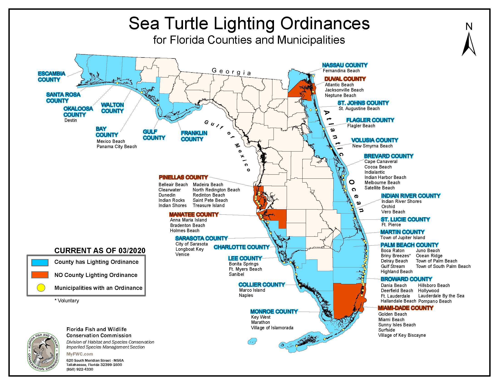
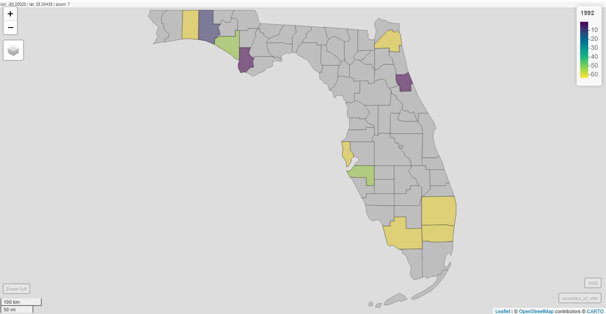
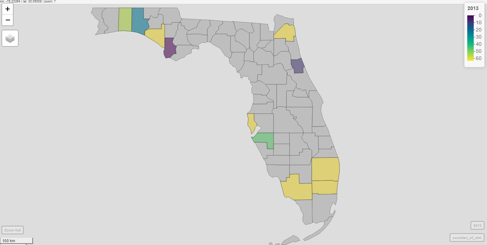

---
title: "Final Project for Environmental Data Analytics"
author: "Grace Choi, Qiaotong Pang, & Jess Garcia"
date: "April 26, 2021"
output:
  pdf_document: default
  html_document:
    df_print: paged
---
**GitHub Repository**

Link to final project repository: [Garcia_Choi_Panf_ENV872_ProjectRepository](https://github.com/jmg144/Garcia_Choi_Pang_ENV872_ProjectRepository)


## Rationale & Research Questions
**Primary Research Question:** Is there a relationship between sea turtle protection policies (light pollution ordinances) in Florida [cities? Counties?] and the amount of radiance those [cities? Counties?] output? 

**Additional Research Questions**

* How does radiance change before these light ordinances go into effect and after? I.e. how does radiance change with time?

* How does average radiance over time vary across cities/counties? 


**Rationale**
The state of Florida provided model lighting ordinance for local governments to develop their own light pollution policies largely to control beachfront lighting to protect hatching sea turtles. Policy implementation is important, but the radiance data can show if the policy has affected the amount of radiance in these Florida counties/municipalities. The amount or change in radiance, perhaps as a result of implementing the policy, is what will impact sea turtle protection. 



*Rationale for Data*  

* The GoogleEarth Data Engine Catalog was chosen because it contains The Defense Meteorological Program (DMSP) Operational Line-Scan System (OLS), which has a unique capability to detect visible and near-infrared (VNIR) emission sources at night. And light pollution or radiance at night is what can negatively impact sea turtle hatchlings.

* The radiance data collected covers from 1992 – 2013.

* For the purposes of this data analysis, we chose to only include counties/municipalities that adopted sea turtle protection ordinances between 1994 and 2011, to make sure that there is room for data before and after the policies took effect (buffers).

 
## Dataset Information

Even though this analysis focuses on average yearly data for radiance, we wanted to check quickly to see how it changes throughout the year. We found higher resolution data that pulled average monthly radiance for the years 2012 to 2020, and looked at Atlantic Beach. We saw that there is seasonality in the data, possibly relating to tourist season. We will still focus on yearly average, but it's good to know.
```{r}

```


## Data Wrangling


```{r data wrangling, echo=FALSE}
# Install/load packages

#packages for spatial analysis
library(tidyverse, quietly = TRUE)
library(sf)
library(leaflet)
library(mapview)
library(lubridate)

# Import Data


```
## Time Series Analysis

```{r time series, echo= FALSE}

```


## Generalized Linear Modeling

```{r GLM, echo= FALSE}

```


## Spatial Analysis

```{r data wrangling for spatial analysis}
##data wrangling for spatial Analysis

getwd()
#Function for demonstrating the status of implementation (Y denotes that it has implemented  the ordinance, and N denotes that it has not implemented the  ordinance)

implementation_status <- function(x,y){
  s<-ifelse(y>x, "Y", "N")
  return(s)
}

#Load Light radiance data
Light_data <- read.csv("../Data/Long_20210419.csv")

#Add the the status of implementation by use function implementation_status and select counties with implementation year between 2000 and 2005
Light_data_processed <- Light_data %>%
  mutate(Status=implementation_status(Implemented, Year)) %>%
  filter(Implemented > 1999 & Implemented < 2006)

#Load Florida Counties shapefile
counties_shp_data<- st_read('../Data/cb_2018_us_county_20m.shp') %>% 
  filter(STATEFP == 12)

#get the combined data (combine counties_shp_data with Light_data_processed)

#Combine Light data with County shp by using COUNTYFP
#load dataset including COUNTYFP and County
FP <- read.csv("../Data/FP1.csv")
FP <- select(FP, County= 1, COUNTYFP)
FP$COUNTYFP <- as.numeric(FP$COUNTYFP)

#1. combine FP with Light data (not sf data)
#select columns of Light_data_processed (drop long and lat)
Light_no_sf <- select(Light_data_processed, X:value, Status)

# merge
Light_FP <- merge(Light_no_sf, FP, by="County", all=TRUE)

#2. combine Light_FP with County shp (not sf data)
#select columns of County shp
Map_match <- select(counties_shp_data, STATEFP:NAME, geometry)
Map_match$COUNTYFP <- as.numeric(Map_match$COUNTYFP)

# merge and drop na
Light_Map_FP <-merge(Map_match,Light_FP, by="COUNTYFP", all=TRUE)
combined_data <- drop_na(Light_Map_FP)

#save combined data
#write.csv(combined_data, row.names = FALSE, file = "../Data/combined_data.csv")

#transfer the Light data and combine data to sf data
Light_sf <- st_as_sf(Light_data_processed,
                  coords = c('Long','Lat'),
                  crs=4326)
```

> We used both mapview and ggplot for sptial analysis

```{r spatial analysis by using mapview}
## plot the light radiance value in all years and all relevant counties simultaneously on one map (mapview function)

#time span
t<-c(1992:2013)

#plot function
plot_years_counties_A <- function(y){
  myMap <- mapview(counties_shp_data, 
                   col.regions='gray',
                   alpha.regions=1,
                   legend=FALSE)
  for (y in t){
    Light_radiation <- filter(combined_data, Year==y)
    myMap <- myMap +
      mapview(Light_radiation, 
              zcol='value',
              alpha.regions=0.5,
              layer.name= y)
    y=y+1
  }
  print(myMap)
}
plot_years_counties_A(1992)


## plot the light radiance value for different years one by one (mapview function)

t<-c(1992:2013)
plot_years_counties_B <- function(y){
  for (y in t){
    Light_radiation <- filter(combined_data, Year==y)
    myMap <- mapview(counties_shp_data, 
                     col.regions='gray',
                     alpha.regions=1,
                     legend=FALSE) +
      mapview(Light_radiation, 
              zcol='value',
              alpha.regions=0.5,
              layer.name= y)
    print(myMap)
    y=y+1
  }
}
plot_years_counties_B(1992)

```

> The graph plotted by mapview can not be knitted, so we show the graphs for 1992 and 2003 as shown:



> As shown above, the value of light radiance decreased in some counties/locations such as Destin & Anna Maria Island; the value of light radiance changed a little in some counties/locations such as GUlf COunty & Jacksonville beach; the value of light radiance decreased in some counties/locations such as Bay County & Walton.

```{r spatial analysis by using ggplot, echo = FALSE}
## ## plot the light radiance value for different years one by one (ggplot function)
t<-c(1992:2013)
plot_years_counties_C <- function(y){
  for (y in t){
    Light_year<- filter(Light_sf, Year==y)
    myMap <- ggplot() + 
      geom_sf(data = counties_shp_data) 
    myMap <- myMap + geom_sf(data = Light_year, aes(color = Status, size= value)) +
      labs(title=y) +
      scale_color_brewer(palette = "YlGnBu")
    print(myMap)
    y<-y+1
  }
}
#plot_years_counties_C(1992)

#D. Compare the mean of the value of light radiance  before and after implementation (mapview function)

#set the color palette 
#colors <- colorRampPalette(c("yellow", "navy"))(14)

#group data by Status and County
Light_group <- 
  Light_data_processed %>%
  group_by(Status,County) %>%
  summarise(meanvalue=mean(value))

#select needed columns
Light_no_sf_2 <- select(Light_data_processed, County, Long:Lat)

# drop duplicates
Light_no_sf_3<- Light_no_sf_2[!duplicated(Light_no_sf_2$County),]

#combine data
Light_group_no_sf <- merge(Light_group, Light_no_sf_3, by="County", all=TRUE)

# sf transfer

Light_group_sf <- st_as_sf(Light_group_no_sf,
                     coords = c('Long','Lat'),
                     crs=4326)
# divided data according to implementation
Light_group_sf_N <- filter(Light_group_sf, Status=="N")
Light_group_sf_Y <- filter(Light_group_sf, Status=="Y")


#data wrangling
Light_group_no_sf_N <- filter(Light_group_no_sf, Status=="N")
Light_group_no_sf_Y <- filter(Light_group_no_sf, Status=="Y")
Light_group_no_sf_Y <- select(Light_group_no_sf_Y, County:meanvalue)


NY <- merge(Light_group_no_sf_N, Light_group_no_sf_Y, by="County")
NY <- mutate(NY, dif=(NY$meanvalue.x-NY$meanvalue.y))

NY_sf <- st_as_sf(NY,
                           coords = c('Long','Lat'),
                           crs=4326)
#plot
myMap <- mapview(counties_shp_data, 
                 col.regions="gray",
                 alpha.regions=1,
                 legend=FALSE) +
  mapview(NY_sf,
          zcol='dif',
          alpha.regions=1,
          cex='meanvalue.x') 
#print(myMap)

#plot by using ggplot

myMap <- ggplot() +
  geom_sf(data = counties_shp_data) +
  geom_sf(data = NY_sf, aes(color = dif, size= meanvalue.x)) +
  scale_color_gradient2(low = 'red', high = 'green', midpoint = 0)

print(myMap)

```
> As mapview also did not work for rmd, so we used ggplot to plot the difference of mean value of the light radiation before and after the implementation of the ordinance for different counties/locations. As shown above, the color denotes the difference between mean value of the light radiation before and after the implementation of the ordinance. Negative df means the light radiation decreased after the implementation of the ordiance and positve df means the light radiation increased after the implementation of the ordiance. The size of the circle represented the value of the mean light radiation before the implementation of the ordiance.

## Summary & Conclusions
**Analysis Summary**

**Conclusions**


```{r setup, include=FALSE}
knitr::opts_chunk$set(echo = TRUE)
```

## R Markdown

This is an R Markdown document. Markdown is a simple formatting syntax for authoring HTML, PDF, and MS Word documents. For more details on using R Markdown see <http://rmarkdown.rstudio.com>.

When you click the **Knit** button a document will be generated that includes both content as well as the output of any embedded R code chunks within the document. You can embed an R code chunk like this:

```{r cars}
summary(cars)
```

## Including Plots

You can also embed plots, for example:

```{r pressure, echo=FALSE}
plot(pressure)
```

Note that the `echo = FALSE` parameter was added to the code chunk to prevent printing of the R code that generated the plot.
